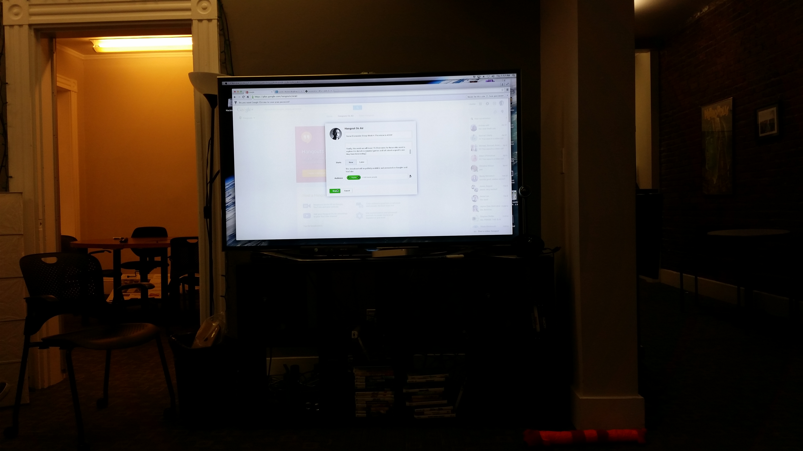

# Event Presentation: Engagement Lab 

(sorry about the quality)

### Synopsis

On Thursday April 23rd, I attended the game discussion at the Engagement Lab. We talked about some simple ASCII games that became viral and how they achieved this. How do these simple single player games create a social component and what keeps players so engaged. The games we played were Candy Box, A Dark Room, and Drowning. Each is a simple game where you click buttons to make decisions that affect how the game continues. What is different about these games is that they incorporate a sense of mystery in that you don’t know what exactly your next move will lead to. For some that played, they liked the sense of nostalgia and simplicity of the games format. Another point that was made is that these games “respect the player” enough to allow them to figure it out as they go, it gives the player more agency and it adds another level of interest into figuring out just how the game works and what will happen later on. These games created their own social component, despite being single player, through people talking about them on social media-- asking questions and talking about scores or later components. This buzz also caused more people to be interested in what was going on and made the games go briefly viral. It was interesting to talk about these seemingly simple and surfacely “boring” games and how they turned out to be something completely different. 

Candy Box: http://candies.aniwey.net/
A Dark Room: http://adarkroom.doublespeakgames.com/
Drowning: http://game.notch.net/drowning/#

The article we read: http://www.gamasutra.com/view/news/191740/Why_Candy_Box_became_more_social_than_social_games.php