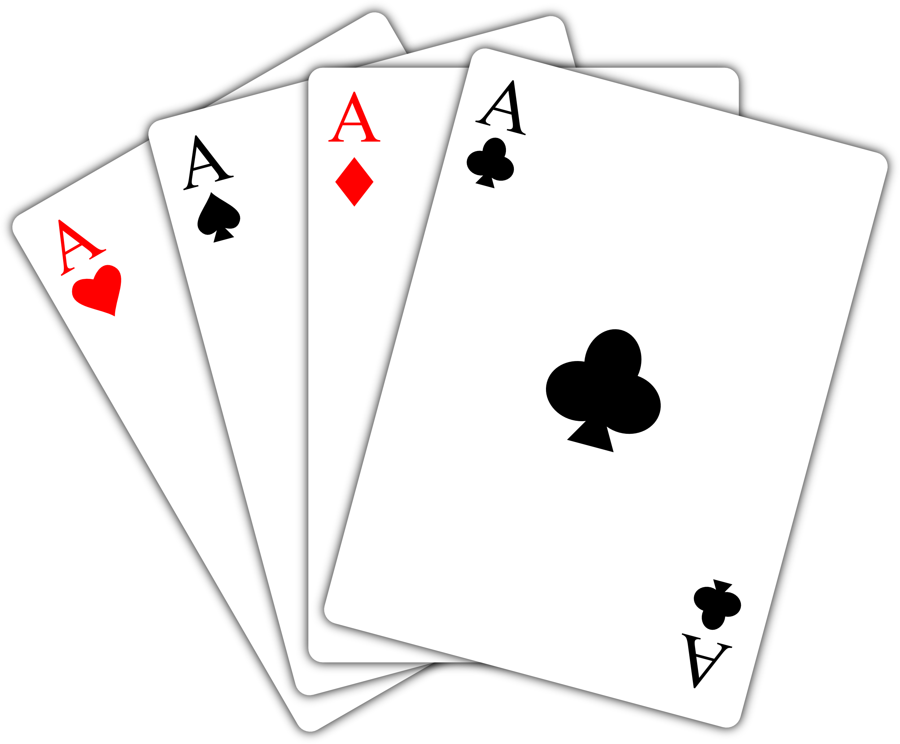

#Campaign

Campaign originally began with a combination of two prompts: __Monopoly__ and __Democracy__.

###Iteration One
The first iteration of this game involved players moving across the board to obtain districts and subsequently win the election.

####How to play:
*Players are split into 2 teams - Blue (Democrat) and Red (Republican).  There must always be an even number of players; one person may play for two figurines.
*Contingent spaces of the same color represent “__districts__.” Players start with their pieces in each corner of the board, in the one-space “district.”
*Players gain “__action points__” from rolling the die.  They may use these points to move around the board (1 point per space, no diagonal movement) and/or put down “points” on a square.
*“Points” are recorded on the team’s scorecard.  Whichever team has the most points gets to put down a __“territory” card__ on that square, claiming it for their party in the “election.”
*Teams may take over another team’s spaces by putting down the number of points the opposing team has on that space + the number of spaces in the district.  Ex: A space in a 4-block district with 6 points on it needs 10 points to be taken over.
*A team may __Win a District__ when the following conditions are met:
  *The team has claim to over half the territories in that district. Ex: 4 spaces in a 5-block district, or 3 spaces in a 4-block district.  1- and 2-block districts must be entirely owned.
*A team may _Win the Game_ when the following conditions are met:
  *All districts in the game are claimed
  *One team has claim to at least 14 districts

###Iteration Two
The first iteration had a lot of problems when actually play tested. The game relied far too much on chance and keeping track of the scores became confusing. Also, there was no substance to really keep the player actively engaged in the game.

####Ideas for Change:
*The game is too separated from actual campaigning.  Is there any way to work some of this in?  Platforms?  Gerrymandering?
*Introduce a card element: Event cards/Position or Ability cards/Action Cards
*Competitive minigame aspect??
We decided that a card playing element to the game would be the most interesting and fun way to improve what we had. We then had the realization that the board was no longer a necessary part to playing the game, and a more card based improvisation/fighting (debate) game would fit what we wanted.
####How to Play:

*Reputation is health/HP.
  *You start with a certain amount, then lose different amounts depending on the prevalence/power of the politician that is disgraced (KO’d)
*Political Parties are the Politician version of Attributes in YuGiOh.  Certain cards will affect only one party at a time.
*Eloquence is attack.
*Charisma is defense.

####Types of Cards:

__Political Strategies__ (equivalent of Magic Cards in YuGiOh)
_15 in total/deck_
1. Campaign Funds (x5) - _May attach to a Politician to up their Eloquence and Charisma by 4 per.  May be applied to each card no more than twice._
2. Wiretapping - _May peek at all face-down cards on the opponent’s field._
3. Gerrymandering - _The magic or trap card to both players’ far right is moved to the opposing player’s left.  (This includes face-down cards.)  They now belong to the opposing player._
4. Lobbying - 
5. Political Alliances - _If [Politician X] and [Politician Y] are both on the field, both get an extra [#] [Eloquence/Charisma]_
6. Celebrity Endorsements - 
7. Fraud - _Player may search through their deck, find a Campaign Funds, and put it in their hand.  Then the deck is reshuffled._
8. Filibustering - _Skips x turns.  Useful if the political climate is against you and you want to hurry its change._

__Slash Campaigns__ (equivalent of Trap Cards in YuGiOh)
_15 in total/deck_
1. Watergate - If opponent attempts to use Wiretapping, Wiretapping is destroyed and the opponent receives x reduction in reputation.
2. Bad Press - 
3. Sex Scandal - 
4. IRS audit - Negates the effects of the opponent’s Campaign Funds that turn.

__Politician Cards__ (equivalent of Monster Cards in YuGiOh)
_15 in total/deck; 2 parties = separate decks_
        __Presidents & Ex-Presidents__ _(Eloquence + Charisma = 64 pts)_
        __Heads of House & VPs__ _(E+C = 58 pts)_
        __Senators and Congressmen__ _(E+C = 52 pts)_
        __State Officials & Governors__ _(E+C = 46 pts)_

__Political Climate Cards__ (Similar to Field Cards in YuGiOh, but operate without the players activating them)
*At the end of every (five?) turns, a Political Climate card is drawn.  This indicates favor towards a particular party (or neither, or both) and add in random variables such as powering up a certain party’s politicians, disabling certain Political Strategies or Slash Campaigns, causing random effects to come into play, etc.  

####Problems:
*Just turned politicians into fighting monsters.
*Had no real originality in game play.
*Cards were unbalanced.

###Iteration Three

####Party Lines
Fight to stay at the top of the popularity polls!

__Materials__ (Prototype)
1 deck of playing cards
3 tokens
Linear board (ex: cribbage board)

 

__Concepts__
* Each color card represents a party (hearts and diamonds are the red party, spades and clubs are the black party).
* Tokens are your politicians/candidates.  Their place on the board is their place in the popularity polls.
* Running out of deck represents the end of the campaign season.  Once the deck runs out, “elections” are held and whoever is highest on the popularity ratings wins.

__Rules__
Each player places their token at the top of the board.

Each player draws a hand of five cards.

A card is taken from the top of the deck and placed face-up on table.  This is the “debate” card.  The “Audience” wants an answer closest in value to the debate card.

Before each player puts down a card, they can announce what they intend to put down.  They may lie.  Everyone puts down their cards--”responses”--face down.  Each player then must choose to throw their support behind a different player’s response card.  You want to vote on a response card that you believe is closest to the debate card.  Once players have decided on their submission and vote, the cards are flipped face-up.

__How to Score Points, 2 Steps.__
1. Average together your card value with the card value of the person who voted for you.  Then move down in “popularity” for the difference between the average and the card.
2. __Party Bonus!__  If your card is either the winning card, or the same party as the winning card, move up one space on the board.  (The debate card is party-neutral.  In a custom deck, it would not even have a suit.)

__How to Win:__
Have the highest rating when the deck runs out or when all other players are “disgraced”.
