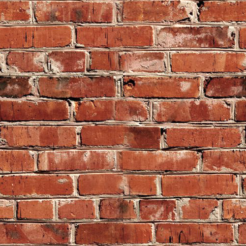
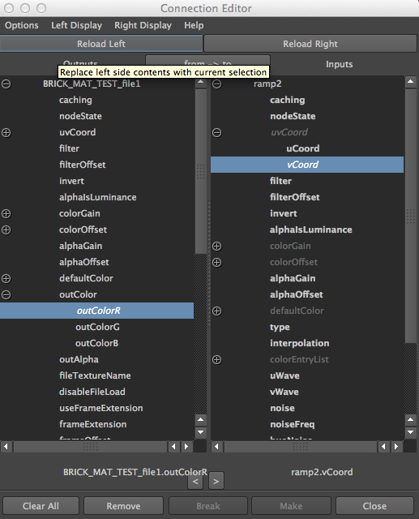
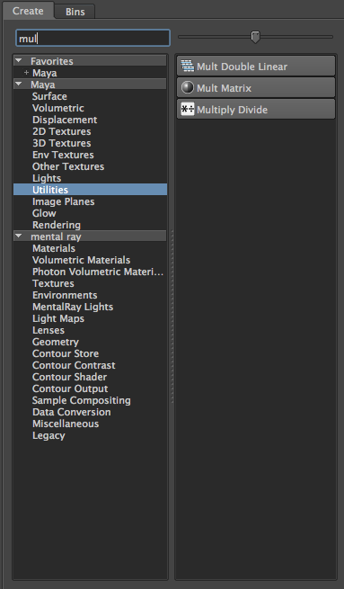

# How to Make the Best Brick Texture

There are many ways to make a brick texture, but often times they come out looking very tiled and unrealistic for your game. This method has been the best way I have found to solve that problem (source at the end).

### Part One: The Texture

The first thing that needs to be done is to pick the bricks you want and crop it to a square (e.g. 512x512).

Make sure it is seemless by duplicating the layer (Ctrl+J) and going to Filter > Other > Offset and then chose values that are half of your image’s dimensions (512 goes to 256).

This will make the outer edges seamless: __important for a good texture__

Erase the harsh lines in the middle until it looks nice like the image above. Merge the layers (Ctrl+E)

Then create a new layer above the original brick in photoshop for the next step.

### Part Two: Setting Up the Texture for Maya

Draw white squares over ⅓ of the bricks, black over another ⅓, and finally 50% grey over the last ⅓ until it looks something like this:

Hide the original brick layer underneath by clicking the eye icon so that you only see the black, white, and grey squares. 

Call it: **CONTROL_bricks.psd**

Next make a lighter version of the original brick, and a darker version by adjusting the levels of the image (Ctrl+L). Save a new version of each so that you now have 3 images.

  

For the next step, open up Maya. 

### Part Three: Assembling the Texture

These next steps will create a tiling texture that will not look like repetitive garbage. 

Example: 

 

You can clearly see the repetition here, and it looks terrible.

* So, in your hypershade window in Maya, create __3 Ramp Nodes__.

Go to the attribute editor of the first Ramp.

For the first one, we’ll have the black on the right, and white on the left at the __selected position: 0.3__.

The second one will have white in the middle starting at 0.3 and ending at 0.6.

The third will be like the first, but instead, the selected position will be 0.6 and ends at 1.0.

*  Create a new file node in the hypershade: **file1**.

Select CONTROL_bricks as file1’s image.

Attach file1 to the first Ramp by middle mouse clicking and dragging it over. 

Select other and the connection editor will appear. 

Choose outColor, then OutcolorR on the left side. On the right side select uvCoord, then vcoord.

Do this for all the ramps. 

It will look something like this:

* Create Three more File nodes and select each of the brick textures as their images: dark, light, and original.

Now create three of these (Multiply Divide): 

Attach one Ramp to each Multiply my middle mouse clicking and dragging. When the menu appears, select *input1*. Attach the brick files and select *input2*.

* Now create a Layered Texture: 

There will be a green box in the attribute editor. Click the smaller one underneath it to create two more boxes for a total of three.

Drag the first Multiply Node on to the Layered and select *inputs[n].color>[1]*.

Do the same for the other two, selecting [2] and [3].

Change the blend mode of each to __add__.

* Create a Lambert.

Middle mouse click and drag the Layered Texture to the Lambert and select Color in the menu.

It’s all connected. 

* Create a Polycube and apply the lambert by middle mouse dragging to see how it looks. 

It might not looks quite right yet. 

Go into each place2Dtexture node and change the UV tiling to 6.

To add another layer to the texture create a 3D texture: __Cloud__

Attach it to the Layered Texture just like the Multiplies before. Set its blending mode to __subtract__. 

Now you should have some nice bricks! Feel free to add a bump map to enhance it even more by adding it to the Lambert Attributes.

**Here’s your texture!**

Source: http://mayazest.blogspot.com/2011/09/creating-realistic-bricks-and-randomly.html
